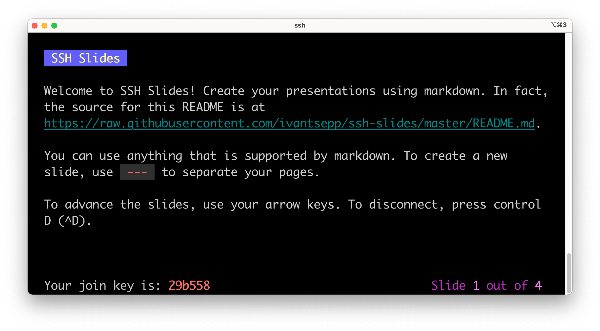

# SSH Slides

SSH Slides is an SSH server that hosts terminal-based presentations where your viewers can follow along in their own terminals. This service is currently located at `slides.tseivan.com`.



## Usage

All you need is a markdown file containing your presentation. To create a new session:

```bash
# To create a session with your own unique name
ssh -t slides.tseivan.com create personal-unique-name URL_TO_RAW_MARKDOWN

# Try out our example presentation
ssh -t slides.tseivan.com create https://raw.githubusercontent.com/ivantsepp/ssh-slides/master/example_presentation.md
```

You will then be entered into a new presentation session where you have control of the slides. Your viewers can then join your session by running the following in their own terminals:

```bash
ssh -t slides.tseivan.com join SESSION_ID

# Try joining our demo presentation session
# These slides auto-advance every 10 seconds
ssh -t slides.tseivan.com join demo
```

Your viewers should then see the same content that you are seeing!

### Navigation

As the creator of the session you can:

1. To go to the next slide: `space`, `right`, `down`, `enter`, `n`, `j`, `l`
2. To go to the previous slide: `left`, `up`, `p`, `h`, `k`
3. To exit and finish the presentation session: `ctrl+c`, `ctrl+d`, `esc`, `q`

As the viewer of the session you can:
1. To exit and leave: `ctrl+c`, `ctrl+d`, `esc`, `q`

### Deploy

```bash
git clone https://github.com/ivantsepp/ssh-slides
cd ssh-slides
go build ssh-slides.go
PORT=22 ./ssh-slides 2> logs.txt &
```

### Implementation

ssh-slides is built on top of other libraries that make it easy to write SSH apps.

- [charmbracelet/wish](https://github.com/charmbracelet/wish)
- [charmbracelet/bubbletea](https://github.com/charmbracelet/bubbletea)
- [gliderlabs/ssh](https://github.com/gliderlabs/ssh)


### Credits / Motivation / Inspiration

- Amazing talk on SSH - https://vimeo.com/54505525
- [maaslalani/slides](https://github.com/maaslalani/slides)
- [fxn/tkn](https://github.com/fxn/tkn)
